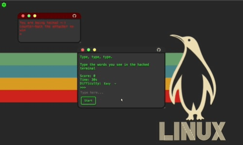

# Terminal Typer - Typing Game

Welcome to Terminal Typer, a hacker-themed typing game where you defend your terminal against incoming attacks by typing fast.

## Gameplay



Type swiftly to neutralize hacking attempts and increase your score. Choose your difficulty level and background image to personalize your gaming experience.

## Features

- **Difficulty Modes**: Easy, Medium, and Hard.
- **Background Customization**: Select backgrounds.
- **Score Tracking**: Try to beat your high score.

## How to Play

1. Clone the repository:
   ```bash
   git clone https://github.com/micah1crandell/terminalThemed-Typing-Game.git
   ```
2. Open index.html in your web browser.

3. Choose difficulty and background.

4. Defend the terminal by typing what the hacker is typing as fast as you can.

